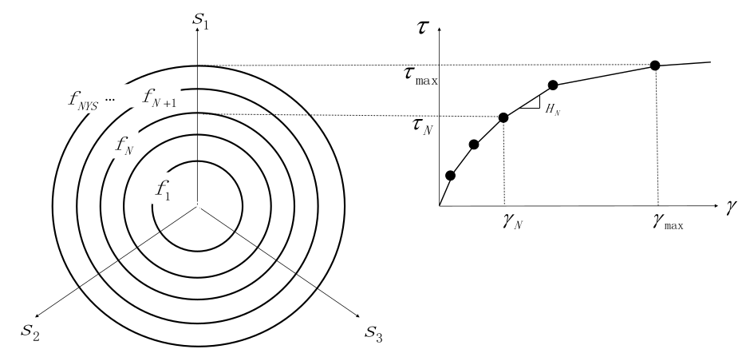
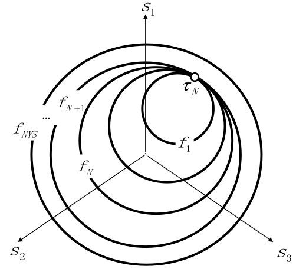
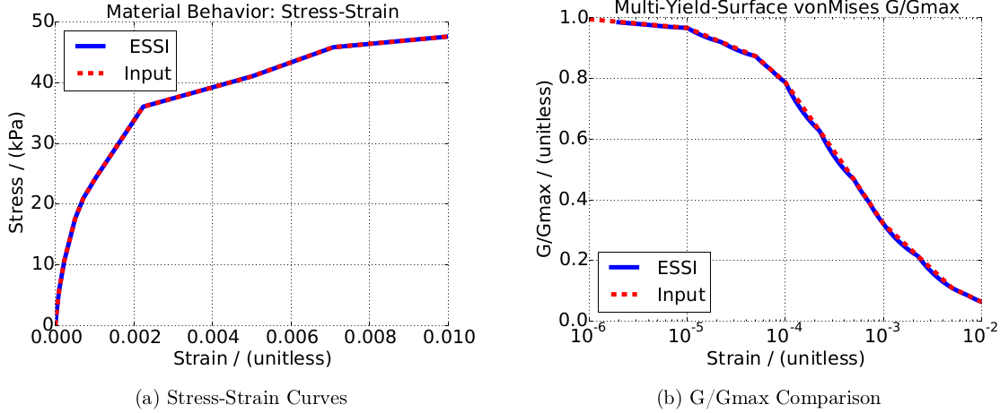
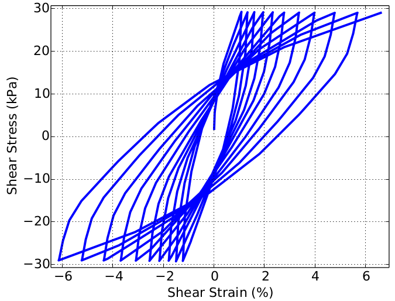

### Description

In order to simulate the realistic shear modulus behavior, multi-surface plastic model is proposed by Mroz and further developed by Prevost. Multi-surface material model is able to match the G/Gmax curves by piecewise linear curves.

As the name implies, multi-surface model is composed of multiple yield surface in the deviatoric stress space. For each yield surface, the stress-strain curve is linear. The shear modulus becomes smaller after the stress states exceed each yield surface.

The multi-surface material models are implemented with a simple python-based GUI for testing.

#### Various Yield Surfaces

Three yield surfaces were implemented for the multi-surface-material model.
- von-Mises
- Drucker-Prager
- rounded-Mohr-Coulomb


#### Illustration

The mapping between multiple yield surfaces and the shear modulus reduction (G/Gmax):




The contact between multiple yield surfaces (ensuring non-overlaps):




The sample stress results and the modulus reduction results:




The cyclic behaviors of the stress-strain results:



#### Prerequisite: 
```bash
sudo apt install python-tk python3-matplotlib
```

#### Notes
Tested on 
* g++-7.4.0
* python 3.6.8

#### Reference

Prevost, Jean H. "A simple plasticity theory for frictional cohesionless soils." International Journal of Soil Dynamics and Earthquake Engineering 4, no. 1 (1985): 9-17.

